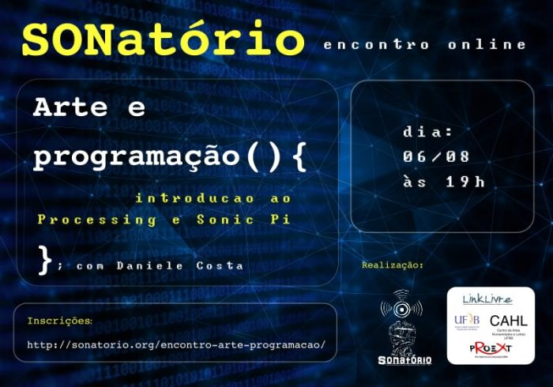

# Encontro online: Arte e Programação (){introdução ao Processing e Sonic Pi}; com Daniele Costa.

Esse site foi desenvolvido para abordar os conteúdos do Encontro online: Arte e Programação (){introdução ao Processing e Sonic Pi}

O encontro aconteceu no dia 6 de agosto de 2020 pelo SONatório (Laboratório de Pesquisa, Prática e Experimentação Sonora - projeto de extensão da UFRB - Universidade Federal do Recôncavo da Bahia)

[Deploy](https://arteprogramacao.netlify.app/)
